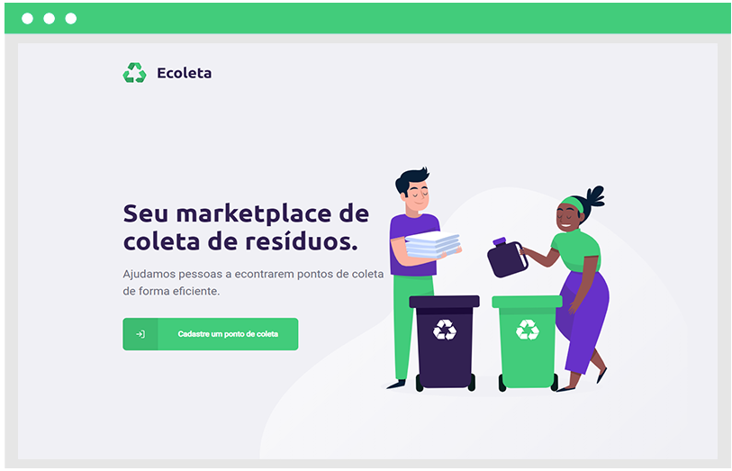

<h1 align="center">

</h1>

♻️ Ecoleta é uma aplicação que visa conectar empresas, mercados e entidades de coleta de resíduos orgânicos e inorgânicos a pessoas que desejam fazer um descarte de maneira que não prejudique o ambiente.

 

Os pontos de coleta podem utilizar a plataforma web para se cadastrar. Ao fazer isso, deve ser enviada uma imagem do ponto de coleta, nome da entidade, e-mail e WhatsApp que serão utilizados para contato, além dos itens que poderão ser coletados no local: lâmpadas, pilhas e baterias, papéis e papelão, resíduos eletrônicos, resíduos orgânicos ou óleo de cozinha.

Já na versão móvel (aplicativo) é possível acessar a plataforma, indicando o estado e a cidade, buscar por locais de coletas para os itens que forem selecionados entre todas as opções disponíveis e, assim, localizar no mapa os pontos de coletas que foram cadastrados.

Ao selecionar um ponto no mapa, os detalhes do ponto de coleta, como endereço e todos os itens que podem ser coletados nele, serão exibidos. Por fim, também é possível entrar em contato com o local da coleta através do WhatsApp ou E-mail, isso é útil caso seja necessário combinar algo ou esclarecer eventuais dúvidas.

Esse projeto foi desenvolvido durante o evento NLW – Next Level Week, que foi oferecido pela Rocketseat. O NLW foi uma experiência online com muito conteúdo teórico e prático, sendo uma excelente experiência para aprender mais sobre desenvolvimento web e móvel.

O projeto é dividido em três partes principais: backend, frontend e mobile. Tudo construído com tecnologias como: React, ReactNative, React-Leaflet, TypeScript, SQLite3, Node.js, Expo, Express, Knex, Multer, entre outras. Além de fazer a integração com a API do IBGE, para pegar as siglas dos estados e os nomes de todos os municípios.


#### Para executar a aplicação

Primeiro execute ```npm install``` nas pastas server (backend), web (frontend) e mobile, para instalar as dependências.

Rode ```npm start``` nas pastas backend e frontend para utilizar a versão web. Acesse via **localhost:3000**.

Rode ```npm start``` nas pastas backend e mobile, acesse **localhost:19002**, leia o QR Code no seu celular e utilize o aplicativo Expo para rodar a versão mobile no seu smartphone. Também é possível executar em algum emulador Android/iOS.

Você pode encontrar esse mesmo projeto em outros repositórios, assim fica mais fácil esclarecer eventuais questionamentos. Além disso, outros desenvolvedores incluíram algumas modificações, explore:
- <a href="https://github.com/christyanbrayan/ecoleta" target="_blank">christyanbrayan</a>;
- <a href="https://github.com/solrachix/Ecoleta" target="_blank">solrachix</a>;
- <a href="https://github.com/tgmarinho/Ecoleta" target="_blank">tgmarinho</a>;


**Instrutor: [Diego Fernandes](https://github.com/diego3g) | CTO Rocketseat**

#### Telas da aplicação
 

